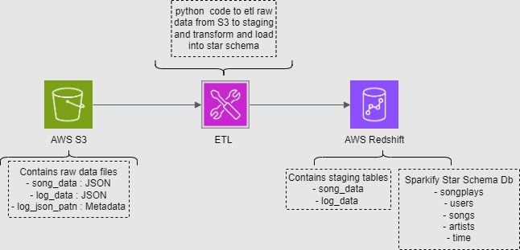
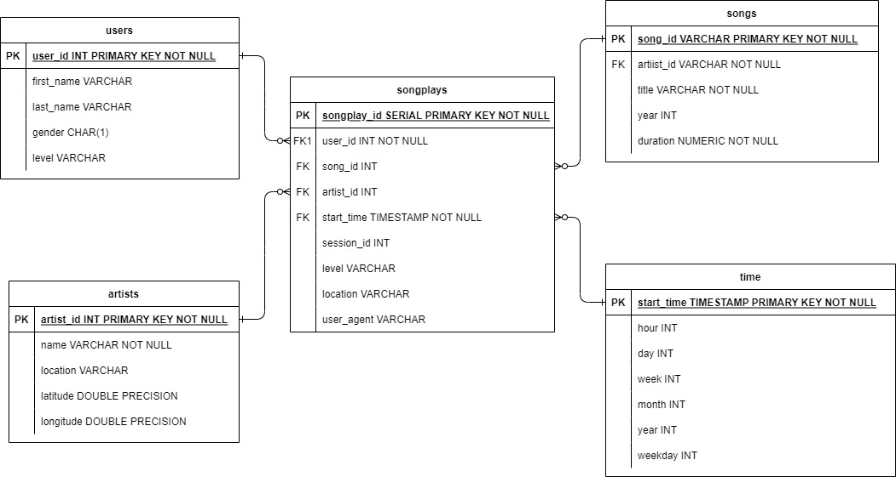

# AWS Cloud Data Warehouse - Sparkify S3 to Redshift ETL

## Problem Statement
A music streaming startup, Sparkify, wants to move their processes and data onto the cloud. Their data resides in S3, in a directory of JSON logs on user activity on the app, as well as a directory with JSON metadata on the songs in their app to AWS Cloud Data Warehouse Redshift for their analytics team to continue finding insights into what songs their users are listening to.

## Solution
Build an ETL pipeline that extracts their data from S3, stages them in Redshift, and transforms data into a set of dimensional and fact tables for reporting purpose.

## Index
- [Files and Requirements](#files-and-requirements)
  * [Files](#files)
  * [Requirements and Technology](#requirements-and-technology)
- [AWS Architecture Diagram](#aws-architecture-diagram)
- [Dimensional Model](#dimensional-model)
- [Run Instructions](#run-instructions)

## Files and Requirements
### Files:
   - `sql_queries.py`: Python file with all SQL queries required to create staging tables and database star schema, Copy data to staging table and inser values to each dimension and fact table.
   - `create_tables.py`: Python file that connects to redhift cluster and runs "CREATE TABLE" queries.
   - `etl.py`: Python file that connects to redhift cluster and runs the "COPY" data into staging area query and also runs the insert queries to the dimension and facts table.
   - `dwh.cfg`: Configuration file to store parameters between other files.
   - `awsUser.cfg`: File with AWS KEY and SECRET KEY, file not included in the repo.
   - `redshift_cluster.ipynb` Jupyter Notebook for creating AWS Redshift Cluster.

### Requirements and Technology
- <u>Python Packages</u>
  * python3
  * boto3
  * json
  * configparser
  * psycopg2
- <u>Software</u>
  *  Jupyter Notebook
- <u>AWS Account</u>

## AWS Architecture Diagram
)

## Dimensional Model    
A Dimensionl Model (a.k.a Star Schema) is a data structure technique optimized for efficient data storage and retreival in a Data warehouse for report and analytics purpose. 
In a star schema, each dimension table is joined to the fact table through a foreign key relationship. This allows users to query the data in the fact table using attributes from the dimension tables
    
)

## Run Instructions
- With you AWS Account:
  * Create a Redshift Cluster with the parameters noted in jupyter notebook.
  * Create IAM client to connect to the cluster Once you hace created your Redshift Cluster, is necesary to get the Endpoint address and IAM client ARN, and save
    this in the `dwh.cfg` file.
- Open a terminal execute the following commands:
  * `python create_tables.py`, this will create the tables, if no errors occur, got to nex step.
  * `python etl.py`, this will load the data into the stagin area and then populate the star schema.
- At this point you should be able to run queries on the data.

## IMPORTANT: Make sure to delete your Redshift cluster and IAM client at the end as this incurs in cost.

